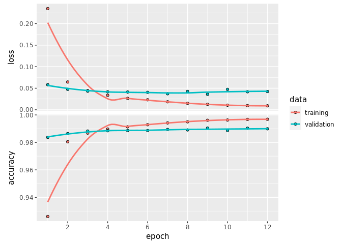

MNIST Digits Recognition with Keras
================

Train a **Convolution Neural Network** on the MNIST dataset using Keras
(Tensorflow backend).

### Set training params

``` r
batch_size <- 128
num_classes <- 10
epochs_n <- 12
```

## Init Keras

``` r
keras::install_keras(tensorflow = "gpu")
```

    ## 
    ## Installation complete.

``` r
library(keras)
```

``` r
suppressPackageStartupMessages({
  library(dplyr)
  library(purrr)
})

sessionInfo()
```

    ## R version 3.6.3 (2020-02-29)
    ## Platform: x86_64-pc-linux-gnu (64-bit)
    ## Running under: Ubuntu 16.04.6 LTS
    ## 
    ## Matrix products: default
    ## BLAS:   /usr/lib/libblas/libblas.so.3.6.0
    ## LAPACK: /usr/lib/lapack/liblapack.so.3.6.0
    ## 
    ## locale:
    ##  [1] LC_CTYPE=en_US.UTF-8       LC_NUMERIC=C              
    ##  [3] LC_TIME=en_US.UTF-8        LC_COLLATE=en_US.UTF-8    
    ##  [5] LC_MONETARY=en_US.UTF-8    LC_MESSAGES=en_US.UTF-8   
    ##  [7] LC_PAPER=en_US.UTF-8       LC_NAME=C                 
    ##  [9] LC_ADDRESS=C               LC_TELEPHONE=C            
    ## [11] LC_MEASUREMENT=en_US.UTF-8 LC_IDENTIFICATION=C       
    ## 
    ## attached base packages:
    ## [1] stats     graphics  grDevices utils     datasets  methods   base     
    ## 
    ## other attached packages:
    ## [1] purrr_0.3.4   dplyr_1.0.0   keras_2.3.0.0
    ## 
    ## loaded via a namespace (and not attached):
    ##  [1] Rcpp_1.0.4.6     rstudioapi_0.11  knitr_1.28       whisker_0.4     
    ##  [5] magrittr_1.5     rappdirs_0.3.1   tidyselect_1.1.0 lattice_0.20-41 
    ##  [9] R6_2.4.1         rlang_0.4.6      stringr_1.4.0    tools_3.6.3     
    ## [13] grid_3.6.3       xfun_0.14        ellipsis_0.3.1   htmltools_0.4.0 
    ## [17] tfruns_1.4       yaml_2.2.1       digest_0.6.25    tibble_3.0.1    
    ## [21] lifecycle_0.2.0  crayon_1.3.4     tensorflow_2.2.0 Matrix_1.2-18   
    ## [25] vctrs_0.3.1      base64enc_0.1-3  zeallot_0.1.0    glue_1.4.1      
    ## [29] evaluate_0.14    rmarkdown_2.3    stringi_1.4.6    pillar_1.4.4    
    ## [33] compiler_3.6.3   generics_0.0.2   reticulate_1.16  jsonlite_1.6.1  
    ## [37] pkgconfig_2.0.3

## Load and preprocessing MNIST dataset

``` r
mnist <- dataset_mnist()
str(mnist)
```

    ## List of 2
    ##  $ train:List of 2
    ##   ..$ x: int [1:60000, 1:28, 1:28] 0 0 0 0 0 0 0 0 0 0 ...
    ##   ..$ y: int [1:60000(1d)] 5 0 4 1 9 2 1 3 1 4 ...
    ##  $ test :List of 2
    ##   ..$ x: int [1:10000, 1:28, 1:28] 0 0 0 0 0 0 0 0 0 0 ...
    ##   ..$ y: int [1:10000(1d)] 7 2 1 0 4 1 4 9 5 9 ...

### Split dataset into the train and test sets

``` r
reshape_array <- function(dt) {
  img_resolution <- c(28, 28)
  names(img_resolution) <- c("width", "height")
  
  # redefine dimension of inputs
  r <- array_reshape(dt, c(nrow(dt), img_resolution[["width"]], img_resolution[["height"]], 1))
  
  r/255 # transform RGB values into [0,1] range
}


# prepare train and test datasets
x_train <- reshape_array(mnist$train$x)
x_test <- reshape_array(mnist$test$x)

y_train <- mnist$train$y
y_test <- mnist$test$y


# convert class vectors to binary class matrices
y_train <- to_categorical(y_train, num_classes)
y_test <- to_categorical(y_test, num_classes)
```

Get input shape:

``` r
input_shape <- c(dim(x_train)[2], 
                 dim(x_train)[3],
                 dim(x_train)[4])

input_shape
```

    ## [1] 28 28  1

### Define CNN arhitecture

``` r
model <- keras_model_sequential() %>%
  
  layer_conv_2d(filters = 64, kernel_size = c(3, 3), activation = "relu", input_shape = input_shape) %>% 
  layer_conv_2d(filters = 128, kernel_size = c(3, 3), activation = "relu") %>% 
  layer_max_pooling_2d(pool_size = c(2, 2)) %>% 
  layer_dropout(rate = .25) %>% 
  
  layer_flatten() %>% 
  layer_dense(units = 128, activation = "relu") %>% 
  layer_dropout(rate = .25) %>% 
  layer_dense(units = num_classes, activation = "softmax")
```

### Compile model

``` r
model %>% compile(
  loss = loss_categorical_crossentropy,
  optimizer = optimizer_adadelta(),
  metrics = c("accuracy")
)

summary(model)
```

    ## Model: "sequential"
    ## ________________________________________________________________________________
    ## Layer (type)                        Output Shape                    Param #     
    ## ================================================================================
    ## conv2d (Conv2D)                     (None, 26, 26, 64)              640         
    ## ________________________________________________________________________________
    ## conv2d_1 (Conv2D)                   (None, 24, 24, 128)             73856       
    ## ________________________________________________________________________________
    ## max_pooling2d (MaxPooling2D)        (None, 12, 12, 128)             0           
    ## ________________________________________________________________________________
    ## dropout (Dropout)                   (None, 12, 12, 128)             0           
    ## ________________________________________________________________________________
    ## flatten (Flatten)                   (None, 18432)                   0           
    ## ________________________________________________________________________________
    ## dense (Dense)                       (None, 128)                     2359424     
    ## ________________________________________________________________________________
    ## dropout_1 (Dropout)                 (None, 128)                     0           
    ## ________________________________________________________________________________
    ## dense_1 (Dense)                     (None, 10)                      1290        
    ## ================================================================================
    ## Total params: 2,435,210
    ## Trainable params: 2,435,210
    ## Non-trainable params: 0
    ## ________________________________________________________________________________

### Train model

``` r
history <- model %>% fit(
  x_train, y_train,
  batch_size = batch_size,
  epochs = epochs_n,
  validation_split = .2
)

plot(history)
```

<!-- -->

Look what’s going on terminal:

    $ htop
    $ watch -n 0.5 nvidia-smi

### Evaluate model

``` r
scores <- model %>% evaluate(
  x_test, y_test, verbose = 1
)

print(sprintf("Loss: %f", scores[[1]]))
```

    ## [1] "Loss: 0.030517"

``` r
print(sprintf("Accuracy: %f", scores[[2]]))
```

    ## [1] "Accuracy: 0.991200"

### References

1.  [Keras
    Examples](https://tensorflow.rstudio.com/guide/keras/examples/),
    Keras for R.
