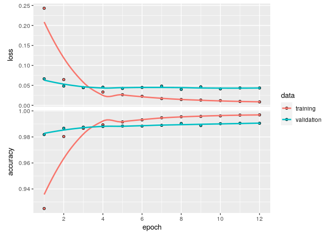

MNIST Digits Recognition with Keras
================

Train a Convolution Neural Network on the MNIST dataset using Keras
(Tensorflow backend).

## Init Keras

``` r
keras::install_keras() # or install_keras(tensorflow = "gpu")
```

    ## 
    ## Installation complete.

``` r
library(keras)
```

## Load and preprocessing MNIST dataset

``` r
mnist <- dataset_mnist()

# split dataset
reshapeArray <- function(dt) {
  img_resolution <- c(28, 28)
  names(img_resolution) <- c("width", "height")
  
  # redefine dimension of inputs
  r <- array_reshape(dt, c(nrow(dt), img_resolution[["width"]], img_resolution[["height"]], 1))
  
  r/255 # transform RGB values into [0,1] range
}

# prepare train and test datasets
x_train <- reshapeArray(mnist$train$x)
x_test <- reshapeArray(mnist$test$x)

y_train <- mnist$train$y
y_test <- mnist$test$y
```

### Set training params

``` r
batch_size <- 128
num_classes <- 10
epochs_n <- 12 # 99.25% test accuracy after 12 epochs
```

### Split dataset into the train and test sets

``` r
# convert class vectors to binary class matrices
y_train <- to_categorical(y_train, num_classes)
y_test <- to_categorical(y_test, num_classes)

input_shape <- c(dim(x_train)[2], 
                 dim(x_train)[3],
                 dim(x_train)[4])
```

### Define CNN arhitecture

``` r
model <- keras_model_sequential() %>%
  
  layer_conv_2d(filters = 64, kernel_size = c(3, 3), activation = "relu", input_shape = input_shape) %>% 
  layer_conv_2d(filters = 128, kernel_size = c(3, 3), activation = "relu") %>% 
  layer_max_pooling_2d(pool_size = c(2, 2)) %>% 
  layer_dropout(rate = .25) %>% 
  
  layer_flatten() %>% 
  layer_dense(units = 128, activation = "relu") %>% 
  layer_dropout(rate = .25) %>% 
  layer_dense(units = num_classes, activation = "softmax")
```

### Compile model

``` r
model %>% compile(
  loss = loss_categorical_crossentropy,
  optimizer = optimizer_adadelta(),
  metrics = c("accuracy")
)

summary(model)
```

    ## Model: "sequential"
    ## ________________________________________________________________________________
    ## Layer (type)                        Output Shape                    Param #     
    ## ================================================================================
    ## conv2d (Conv2D)                     (None, 26, 26, 64)              640         
    ## ________________________________________________________________________________
    ## conv2d_1 (Conv2D)                   (None, 24, 24, 128)             73856       
    ## ________________________________________________________________________________
    ## max_pooling2d (MaxPooling2D)        (None, 12, 12, 128)             0           
    ## ________________________________________________________________________________
    ## dropout (Dropout)                   (None, 12, 12, 128)             0           
    ## ________________________________________________________________________________
    ## flatten (Flatten)                   (None, 18432)                   0           
    ## ________________________________________________________________________________
    ## dense (Dense)                       (None, 128)                     2359424     
    ## ________________________________________________________________________________
    ## dropout_1 (Dropout)                 (None, 128)                     0           
    ## ________________________________________________________________________________
    ## dense_1 (Dense)                     (None, 10)                      1290        
    ## ================================================================================
    ## Total params: 2,435,210
    ## Trainable params: 2,435,210
    ## Non-trainable params: 0
    ## ________________________________________________________________________________

### Train model

``` r
history <- model %>% fit(
  x_train, y_train,
  batch_size = batch_size,
  epochs = epochs_n,
  validation_split = .2
)

plot(history)
```

<!-- -->

Look what’s going on terminal:

    $ htop
    $ watch -n 0.5 nvidia-smi

### Evaluate model

``` r
scores <- model %>% evaluate(
  x_test, y_test, verbose = 1
)

print(sprintf("Loss: %f", scores[[1]]))
```

    ## [1] "Loss: 0.034143"

``` r
print(sprintf("Accuracy: %f", scores[[2]]))
```

    ## [1] "Accuracy: 0.990800"

### References

1.  LeCun, Yann, et al. [Gradient-based learning applied to document
    recognition](http://yann.lecun.com/exdb/publis/pdf/lecun-98.pdf),
    1998.
2.  [MNIST database](https://en.wikipedia.org/wiki/MNIST_database).
    Wikipedia.
3.  [Keras
    Examples](https://tensorflow.rstudio.com/guide/keras/examples/),
    Keras for R.
